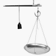

8.  如图，为一种轻质的老式秤。某次称量时，称量的物品和秤盘的总质量为$800$g，秤砣到手拉环的距离为$s$cm时，刚好平衡。若秤盘到手拉环的距离为$5$cm，秤砣质量为$m$g，且$m$和$s$满足$m=8s+40$，则$s$的值为（              ）。

    
    A.$30$                                B.$25$                                C.$20$                                D.$55$