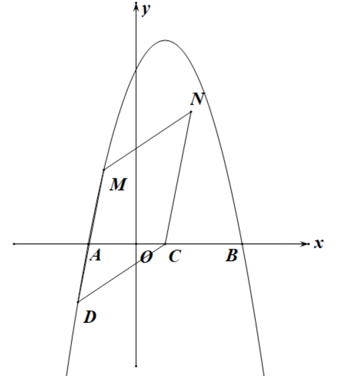
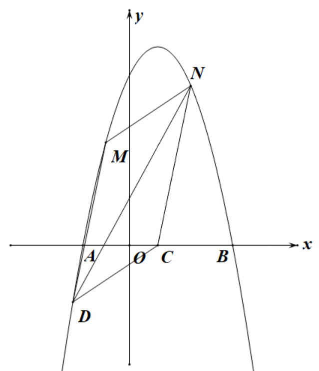

## 第二十二章           二次函数

时间：2小时&nbsp&nbsp&nbsp&nbsp&nbsp&nbsp&nbsp&nbsp&nbsp&nbsp&nbsp&nbsp&nbsp&nbsp&nbsp&nbsp满分：120分

##### 一、选择题（每小题$3$分，共$30$分）

1.   
2.   
3.   
4.   
5.   
6.   
7.   
8.   
9.   
10.  

##### 二、填空题（每小题$3$分，共$18$分）

11.  
12.   
13.   
14.   
15.   
16.  

##### 三、解答题（共$72$分）

17.   

     (1)

     (2)

18.   

     (1)

     (2)

19.   

     (1)

     (2)

20.   

     (1)

     (2)

21.   

     (1)

     (2)

22.   

     (1)

     (2)

     (3)

23.   

     (1)

     (2)

     (3)

24.  如图，抛物线$y=-x^2+ax+b$与$x$轴分别交于$A,B$两点(点$A$在点$B$的左侧)，$C(1,0)$是$AB$中点，已知抛物线最高点纵坐标为$7$，平行四边形$CDMN$的顶点$DE$均在此抛物线上。

     (1) 直接写出抛物线的解析式。

     (2) 如图1，若点$D$横坐标为$-2$，点$E$在第一象限，平行四边形$CDMN$的面积是$13$，求点$N$的坐标。

     (3) 如图2，若点$N$在抛物线上，连$DN$，试证明$DN$恒过一定点，并求出此点坐标。

     
&nbsp&nbsp&nbsp&nbsp&nbsp&nbsp&nbsp&nbsp&nbsp

图1&nbsp&nbsp&nbsp&nbsp&nbsp&nbsp&nbsp&nbsp&nbsp&nbsp&nbsp&nbsp&nbsp&nbsp&nbsp&nbsp&nbsp&nbsp&nbsp&nbsp&nbsp&nbsp&nbsp&nbsp&nbsp&nbsp&nbsp&nbsp&nbsp&nbsp&nbsp&nbsp&nbsp&nbsp&nbsp&nbsp&nbsp&nbsp&nbsp&nbsp&nbsp&nbsp&nbsp&nbsp&nbsp&nbsp&nbsp&nbsp&nbsp&nbsp&nbsp&nbsp&nbsp&nbsp&nbsp&nbsp&nbsp&nbsp&nbsp&nbsp&nbsp&nbsp&nbsp&nbsp&nbsp&nbsp&nbsp&nbsp&nbsp&nbsp&nbsp&nbsp图2
